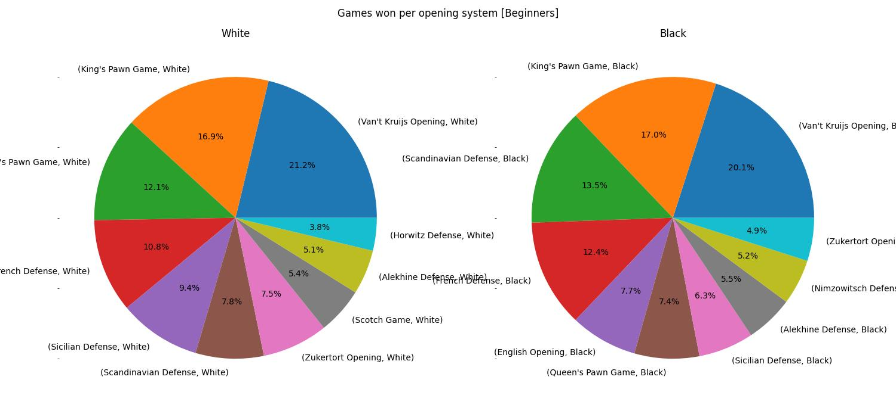

<p align="center">
  
</p>

# Analysis of Chess Openings

## Table of contents

- [Introduction](#Introduction)
- [Download](#Download)
- [Files in this Repository](#Files-in-this-Repository)
- [Installation and Libraries](#Installation-and-Libraries)
  - [Create the Virtual Environment](#Create-the-Virtual-Environment)
  - [Install Python Libraries](#Install-Python-Libraries)
  - [Start the Jupyter Notebook](#Start-the-Jupyter-Notebook)
- [Results](#Results)
  - [Question 1: What are the most frequently used opening systems?](#question-1-what-are-the-most-frequently-used-opening-systems)
  - [Question 2: Do we see a change in the most frequently used opening systems if we break the data by skill level?](#question-2-do-we-see-a-change-in-the-most-frequently-used-opening-systems-if-we-break-the-data-by-skill-level)
  - [Question 2: What are the most sucessful opening systems for White or Black per skill level?](#what-are-the-most-sucessful-opening-systems-for-white-or-black-per-skill-level)


## Introduction

I am a chess player. I used to play in my youth a lot but then lost
contact to the game due to lack of playing partners. I couple of
years ago I discovered [Lichess.org](https://lichess.org) and got back into playing. This
re-boosted my playing level and os I thought I use their free data
for this data science project on chess openings.

[Lichess.org](https://lichess.org) is a free online chess server that provides an extensive
data set on all games that have been played between Jan 2013 until
today at the [Lichess.org open database](https://database.lichess.org/). At the time of writing, this
data comprises almost 1.5TB. The data is split into files per month
that stored as compressed PGN. PGN data provides metadata on the games,
the moves made in the games plus timing and scoring information. It
is tailored for chess engines to replay and analyze games.
In our example, we only need the game metadata.

## Download

Clone this repository to you local system by running

``` bash
git clone <URL of the repo>
cd chess-openings
```

## Files in this Repository

- **chess_openings.ipynb**: The jupyter notebook containing the
  analysis code.
- **lichess_db_standard_rated.csv.gz**: A ready-made CSV file
  containing the metadata of 121,322 Lichess games.
  `chess_openings.ipynb` will directly read tthis file.
- **README.md**: This README file.
- **images**: A directory containing images used in the blog
- **pgn2csv.py**: A PGN to CSV converter for preprocessing PGN data. 

There is no need to run the PGN-to-CSV converter. It extracts the
metadata, applies some cleansing, strips the game moves and writes
the data as csv. The sample file `lichess_db_standard_rated.csv.gz`
was produces using this converter. The resulting CSV files are much
smaller and load much faster. If you want to analyze other PGN files
you need to run `pgn2csv.py` on them. 

``` bash
$ python3 ./pgn2csv.py <your pgn input file with games data> <your csv output file>
```

## Installation and Libraries

This repository provides a jupyter notebook. Prior to running the
notebook you must install the follwing python libraries preferrably
in a python virtual environment in which also the jupyter notebook is
started

### Create the Virtual Environment

It is beneficial to install a dedicated python virtual envirionment
such that the libraries installed in the following step are kept separate
and don\\'t interfere with any other project.

``` bash
$ python3 -m venv venv
$ . venv/bin/activate
```

### Install Python Libraries

The libraries needed for this notebook are `pandas`, `numpy`, `matplotlib`
and `jupyter`. `python-chess` is only necessary if you want to run
`pgn2csv.py`. Run in your activated venv:

``` bash
(venv)$ pip3 install pandas numpy matplotlib jupyter
```

### Start the Jupyter Notebook

Start the jupyter notebook in the venv.

``` bash
(venv)$ jupyter notebook
```

Open `chess_openings.ipynb` and step through the analysis.

## Results

The analysis concentrates on three questions:

### Question 1: What are the most frequently used opening systems?

We see the expected mix of are and complex opening systems for White
which is due to the fact that the analysis was perfromed across all
games independent of the players skill levels.  

The first three ranks contain complex systems with many variants that
are probably used by more experienced players. The King\\'s Pawn Game
is a special case since it is both a system that beginners learn first
as well as a system that is sometimes used by experienced players.
Rank 5 and 6 are examples of rare openings probably used by beginners.

 

### Question 2: Do we see a change in the most frequently used opening systems if we break the data by skill level?

Yes, we do. The change is as expected. In the beginners level, the
King\'s Pawn Game dominates. In addition, we see rare and aggrassive
openings such as Scandinavian, Van\'t Kruijs, Hungarian and Kadas.
These openings aim to outsmart the opponent quickly or luring him into
a trap, and can thus hardly be seen on tournament level. As we move
on to intermediate players, the Sicilian Defense begins to dominate
and keeps doing so in the higher layers. The King\'s Pawn Game is on
a decline. Intemediate players apparently pick more sophisticated
openings and we can see the rise of the Queen\'s Pawn Game and the
French Defense. In the intermediate level this evolution continues.
The King\'s Pawn Game has completely disappeared from the top-10 list
and common openings such as Sicilian, French, Queen\'s Pawn Game or
the Caro-Cann system can be seen. In the top-10 list of openings on
expert level, Sicilian advances its lead to more than 33%, leading by
far over French with 15%. English and the Caro-Cann system got 
stronger and the Queen's Gambit Declined shows up.  


### Question 3: What are the most sucessful opening systems for White or Black per skill level?

In the beginner level, for both Black and White King\'s Pawn Game
or Van\'t Kruijs seem to be the recommended choice since White won
in more than 20% and 17% of all cases, respectively, which is better
than for any other opening.



At intermediate level, the ranking up to rank 4 is the same for
Black and White with Sicilian Defense, King's Pawn Game, French
Defense, and Queen\'s Pawn Game being the most promising choices.


At advanced level, King\'s Pawn is not successful anymore for White
while Sicilian, French, and Queen\'s Pawn keep their strong positions.
Sicilian seems very successful for Black.


For expert level players, Sicilian seems to be the opening base of
choice both for White and Black. White won in 21% of all cases,
clearly ahead of French. For Black the numbers are very clear.
Black won with Sicilian in 35% or all cases, almost three times as
often as with the runner-up French. 


