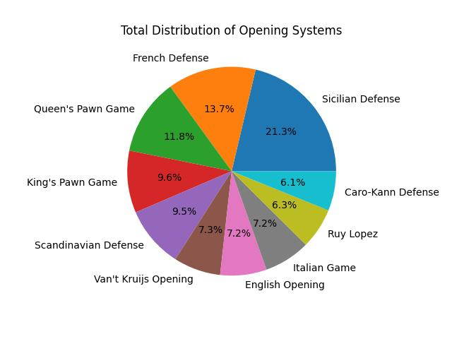

  

# Chess Openings: How often they are played and what are their success rates?

I am a chess player. I used to play a lot but when I was younger but then lost
contact to the game due to lack of playing partners. A couple of
years ago I discovered [Lichess.org](https://lichess.org) and got back into playing. This
re-boosted my playing level and so I thought I use their free data
for this data science project on chess openings.

[Lichess.org](https://lichess.org) is a free online chess server that provides an extensive
data set on all games that have been played between Jan 2013 until
today at the [Lichess.org open database](https://database.lichess.org/). At the time of writing, this
data comprises almost 1.5TB.

Lichess data provides information about the players' skill (in terms of their [ELO](https://en.wikipedia.org/wiki/Elo_rating_system) points), the result
of the game and, most importantly for the purposes of this article, the opening that was played. I ran
a data science study and investigated three key questions.

1. **What are the most frequently used opening systems?**
2. **What are the most frequently used opening systems in different skill levels?**
3. **What are the most succeessful opening systems for White and Black per skill level?**

## The Data

Lichess free data is in PGN format. It provides metadata on the games,
the moves made in the games plus timing and scoring information. It
is tailored for chess engines to replay and analyze games. I was interested only
in the metadata.  

  

I added an `opening_base` column that generalizes the particular opening to the root opening system. Chess openings are classified in a tree-like fashion. The tree starts at the opening system (e.g., Queen's Pawn Game) and then names the variants and sub-variants (e.g., Queen's Pawn Game: Colle System, Anti-Colle). There are complex openings with lots of variants for which a lot of theoretical research has been done, and less complex openings. In order to get reasonably sized classes, I decided to map the individual opening to its opening system which is stored in a separate column.
For this article, I picked a sample file containing the metadata of 121,322 Lichess games
with 9 attribute each:

- `eco`: the [ECO code](https://en.wikipedia.org/wiki/Encyclopaedia_of_Chess_Openings)of the opening
- `opening`: the opening name
- `opening_base`: the opening system (see above)
- `winner`: the winner of the game as one of ['White', 'Black', 'Draw'].
- `timestamp`: when the game was played
- `time_control`: Time limit plus seconds added per move
- `termination`: Reason for terminating the game as one of ['Normal', Time forfait'].

The original PGN data also contained the playesr's Lichess user names. I stripped them for privacy reasons.

## Q1: What are the most frequently used opening systems?

This is the easiest of all questions to answer. We only have count the unique opening systems. The top-10
of this list is shown below. We see a mix of rare and complex opening systems
which is due to the fact that the analysis was performed across all
games independent of the players skill levels.

The first three ranks contain complex systems with many variants that
are probably used by more experienced players. The King's Pawn Game
is a special case since it is both a system that beginners learn first
as well as a system that is sometimes used by experienced players.
Rank 5 and 6 are examples of rare openings probably used by beginners.

## Q2: What are the most frequently used opening systems in different skill levels?

## Q3: What are the most succeessful opening systems for White and Black per skill level?

## Key Takeaways
